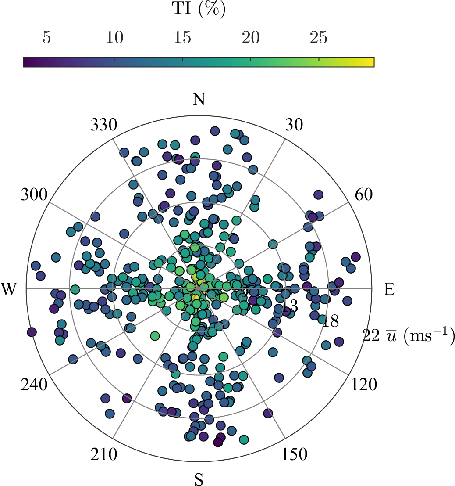

# scatterWindRose

Plot a wind rose as a scatter plot

Plot a wind rose as a scatter plot with two or three variables to optimize the quantity of information that can be obtained on a single figure. 
The objective is to plot a wind rose that shows complementary information to the one obtained with the classical wind roses. These 2 possibilities are here highlighted by examples:

- a wind rose with 3 variables, i.e. for example the wind direction, the wind speed and the turbulence intensity.

- a wind rose with 2 variables and multiple sensors.

Example of wind roses with scattered data: Figure 4 in https://link.springer.com/article/10.1007/s00348-016-2275-9

## Example 

